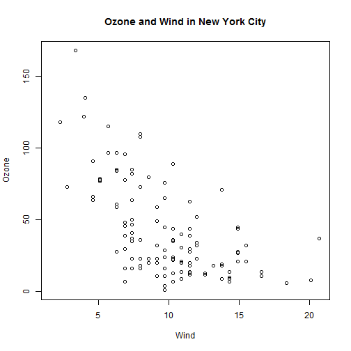

## Exploratory Graphs

Air Pollution in the United States 

- The U.S. Environmental Protection Agency (EPA) sets national ambient air quality standars for outdoor air pollution.  
    - U.S. National Ambient Air Quality Standards  
  
- For fine particle pollution (PM2.5), the "annual mean, averaged over 3 years"  cannot exceed 12 ug/m3  

- Question: Are there any countries in the U.S. that exceed that national standard for fine particle pollution?

### Data

Annual average PM2.5 averaged over the period 2008 through 2010


```r
pollution <- read.csv("data/avgpm25.csv", colClass = c("numeric",
              "character", "factor", "numeric", "numeric"))
head(pollution)
```

```
##     pm25  fips region longitude latitude
## 1  9.771 01003   east    -87.75    30.59
## 2  9.994 01027   east    -85.84    33.27
## 3 10.689 01033   east    -87.73    34.73
## 4 11.337 01049   east    -85.80    34.46
## 5 12.120 01055   east    -86.03    34.02
## 6 10.828 01069   east    -85.35    31.19
```

```r
# Do any counties exceed the standard of 12 ug/m3?
# Five number summary
summary(pollution$pm25)
```

```
##    Min. 1st Qu.  Median    Mean 3rd Qu.    Max. 
##    3.38    8.55   10.00    9.84   11.40   18.40
```

```r
# Boxplot
boxplot(pollution$pm25, col = "blue")
```

 

```r
# Histogram
hist(pollution$pm25, col = "green")
rug(pollution$pm25)
```

 

```r
hist(pollution$pm25, col = "green", breaks = 100)
rug(pollution$pm25)
```

 

```r
# Overlaying features
boxplot(pollution$pm25, col = "blue")
abline(h = 12)
```

 

```r
hist(pollution$pm25, col = "green")
abline(v = 12, lwd = 2)
abline(v = median(pollution$pm25), col = "magenta", lwd = 4)
```

 

```r
# Barplot
barplot(table(pollution$region), col = "wheat", main = "Number of Counties in Each Region")
```

 

```r
# Two Dimensions Simple Summaries of Data
# Multiple Boxplots
boxplot(pm25 ~ region, data = pollution, col = "red")
```

 

```r
# Multiple Histograms
par(mfrow = c(2, 1), mar = c(4, 4, 2, 1))
hist(subset(pollution, region == "east")$pm25, col = "green")
hist(subset(pollution, region == "west")$pm25, col = "green")
```

 

```r
par(mfrow = c(1, 1))

# Scatterplot
with(pollution, plot(latitude, pm25))
abline(h = 12, lwd = 2, lty = 2)
```

 

```r
# Scatterplot - Using color
with(pollution, plot(latitude, pm25, col = region))
abline(h = 12, lwd = 2, lty = 2)
```

 

```r
# Multiple Scatterplots
par(mfrow = c(1, 2), mar = c(5, 4, 2, 1))
with(subset(pollution, region == "west"), plot(latitude, pm25, main = "West"))
with(subset(pollution, region == "east"), plot(latitude, pm25, main = "East"))
```

 

## Base Plotting System.


```r
# Some default values for global graphics parameters.
par("bg")
```

```
## [1] "transparent"
```

```r
par("mar")
```

```
## [1] 5.1 4.1 4.1 2.1
```

```r
par("mfrow")
```

```
## [1] 1 1
```

```r
# Base plot with annotation
library(datasets)
with(airquality, plot(Wind, Ozone))
title(main = "Ozone and Wind in New York City") # Add a title.
```

 

```r
with(airquality, plot(Wind, Ozone), main = "Ozone and Wind in New York City")
with(subset(airquality, Month == 5), points(Wind, Ozone, col = "blue"))
```

 

```r
with(airquality, plot(Wind, Ozone, main = "Ozone and Wind in New York City",
                      type = "n"))
with(subset(airquality, Month == 5), points(Wind, Ozone, col = "blue"))
with(subset(airquality, Month != 5), points(Wind, Ozone, col = "red"))
legend("topright", pch = 1, col = c("blue", "red"), legend = c("May", "Other Months"))
```

 

```r
# Base plot with regression line
with(airquality, plot(Wind, Ozone, main = "Ozone and Wind in New York City", pch = 20))
model <- lm(Ozone ~ Wind, airquality)
abline(model, lwd = 2)
```

 

```r
# Multiple base system
par(mfrow = c(1, 2))
with(airquality, {
  plot(Wind, Ozone, main = "Ozone and Wind")
  plot(Solar.R, Ozone, main = "Ozone and Radiation")
})
```

 

```r
par(mfrow = c(1, 3), mar = c(4, 4, 2, 1), oma = c(0, 0, 2, 0))
with(airquality, {
  plot(Wind, Ozone, main = "Ozone and Wind")
  plot(Solar.R, Ozone, main = "Ozone and Solar Radiation")
  plot(Temp, Ozone, main = "Ozone and Temperature")
  mtext("Ozone and Weather in New York City", outer = TRUE)
})
```

 

